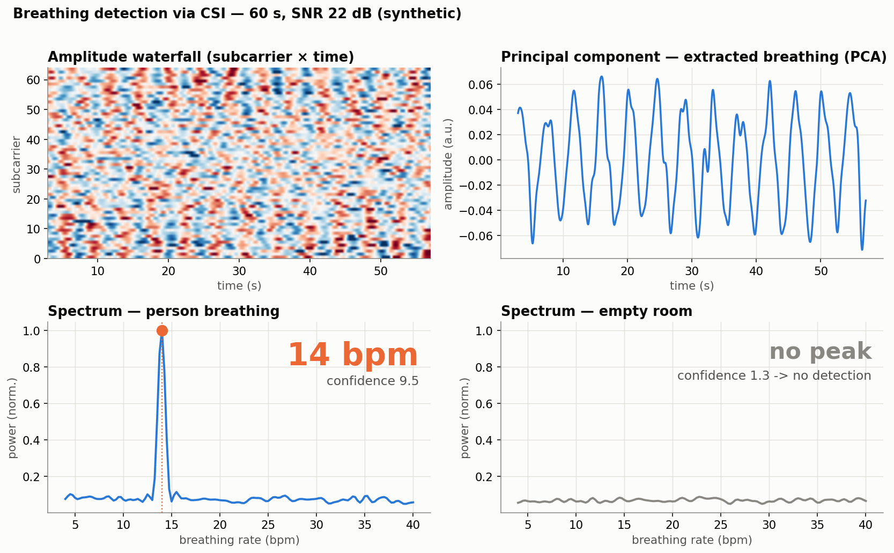
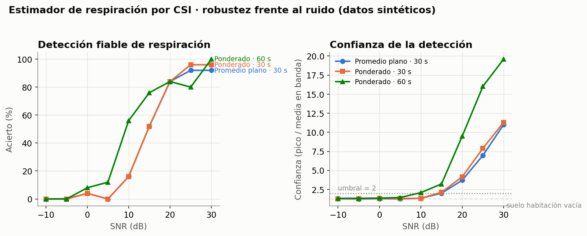

# WiFi Sensing with CSI — camera-free presence & breathing detection

Detect **presence, motion and breathing** of a person from the perturbations the
human body causes in a WiFi signal (*Channel State Information*, CSI). No camera →
privacy by design. RF passes through drywall, so it works across walls.

> **What it is:** a DSP + ML pipeline that, from the CSI of a single WiFi link,
> tells you *someone is here / moving / still and breathing at X bpm*.
>
> **What it is not:** it does not reconstruct images or body pose. Skeleton
> estimation ("DensePose from WiFi") is deliberately out of scope.

## Demo

Estimating the **breathing rate of a motionless person** (the signal is buried in
the raw CSI; the DSP pulls it out, and the system *refuses* when nobody is there
instead of inventing a number):



**Honest evaluation** — robustness against noise (where it works and where it
stops working). The biggest lever is window length, not the model:



> Both figures are generated on **synthetic CSI with known ground truth** (to
> validate the algorithm while isolating the physics). Capture with real hardware
> (2× ESP32) is the next step.

## How it works

```
CSI CSV     ──►  preprocessing        ──►  { windowing + classifier   ──►  presence / motion
(ESP32)          (null subcarriers ·       { breathing (FFT + PCA)     ──►  respiratory rate
                  spike removal ·          real-time verdict (stream)
                  low-pass)
```

- **Preprocessing** ([src/preprocess.py](src/preprocess.py)): drops null
  subcarriers, crushes impulsive spikes (robust Hampel filter) and band-limits to
  the slow motion/breathing band (zero-phase Butterworth).
- **Breathing** ([src/breathing.py](src/breathing.py)): temporal FFT with
  zero-padding + weighted subcarrier combining + a **confidence** score
  (peak/band-mean) that prevents false positives in an empty room.
- **Motion classifier** ([src/features.py](src/features.py),
  [src/train.py](src/train.py)): temporal-variability features → RandomForest
  (baseline).
- **Real time** ([src/stream.py](src/stream.py)): reads the CSV as it grows, keeps
  a sliding buffer and emits a live verdict.

## Modules

| File | What it does |
|---|---|
| `src/synth_csi.py` | Generates synthetic CSI (motion & breathing) to validate without hardware |
| `src/capture.py` | Records CSI to CSV straight off the receiver's serial port |
| `src/load_esp32.py` | Loads the real ESP32-CSI-Tool CSV → amplitude matrix |
| `src/preprocess.py` | Cleanup: null subcarriers → spike removal → low-pass |
| `src/features.py` | Features + sliding windows |
| `src/breathing.py` | Respiratory-rate estimator + confidence |
| `src/dataset.py` | Builds a labeled dataset from `data/raw/*.csv` |
| `src/train.py` | Trains and evaluates the motion/still classifier |
| `src/stream.py` | Incremental reader + live 3-state monitor |
| `notebooks/02_demo_respiracion.ipynb` | Visual demo of breathing detection |

## Getting started

```powershell
python -m venv .venv
.\.venv\Scripts\Activate.ps1
pip install -r requirements.txt
```

Breathing demo (on synthetic data, no hardware needed):

```powershell
jupyter notebook notebooks/02_demo_respiracion.ipynb
```

End-to-end classification pipeline:

```powershell
$env:PYTHONPATH="."; python src/train.py
```

## Dataset

Recorded with 2× ESP32-WROOM-32 (ESP32-CSI-Tool), one bedroom, one person,
~107 packets/s, 64 subcarriers, channel 1, PHY rate pinned to MCS0 so every frame
is identical. Published because the numbers below mean nothing without it — and
because the geometry that produced it no longer exists.

| Folder | Contents |
|---|---|
| `data/raw/` | 10 recordings of 60 s: 5× `vacio` (empty room), 5× `mov` (person walking). Classes alternated; fan off, phone in airplane mode at a fixed spot, door closed, nothing moved between takes. |
| `data/breathing/` | Person lying still, breathing at a **paced** rate as ground truth. `resp_6rpm` / `resp_12rpm` (link in the room), `resp_puerta*` (transmitter outside, door closed/open), `resp_vacio` (negative control). |

## Status & honesty

- **Presence / motion: 0.987 ± 0.012 accuracy, cross-recording** — each fold
  trains on 8 recordings and tests on 2 the model never saw. Dropping the
  absolute-level features costs almost nothing (0.984), so the model runs on
  temporal variability, not on signal strength.
  **This is a floor, not an achievement:** one room, one geometry, one person,
  15 minutes. "Empty room vs person walking" is the easiest discrimination in the
  field (12× energy ratio in the 0.5–5 Hz band).
- **Breathing: detected.** Paced at 6 breaths/min, the estimator returns
  **0.100 Hz = 6.0 rpm with 39.1 dB SNR** in line of sight; an empty room returns
  7.9 dB at a random frequency. The rate was verified by *prediction*: changing
  the paced rate moved the measured peak exactly where predicted.
- **Breathing without line of sight (transmitter outside, door closed): works,
  but it is fragile.** Two runs of the nominally identical setup gave 3.3 dB and
  17.3 dB. The RSSI moved 8 dB between them, so they were not in fact identical —
  losing the direct path makes the result hostage to details you do not control.
  Characterising this properly needs repetitions per condition, not single shots.
- **Known, accepted limit:** CSI **does not generalize across rooms** (the static
  channel changes). Honest evaluation requires training on some recordings and
  testing on **different** ones of the same class; a naive cross-validation over a
  single recording inflates the results. For a new environment you recalibrate on
  site (record a few minutes per class and retrain).
  The breathing estimator is exempt: it is frequency **estimation**, not
  classification — nothing is learned, so there is no domain to depend on.
- **Not attempted, and not possible with this hardware:** imaging a figure through
  a wall (RF-Pose style). That needs an antenna array; 1 TX + 1 RX with one
  antenna each has no spatial resolution.

## Context

The **IEEE 802.11bf (WLAN Sensing)** standard is already published; WiFi sensing
is an active field (presence, elderly care, smart buildings). This project draws
on the CSI-sensing line of work (activity and vital-sign detection such as
breathing) and favors **one well-solved, honestly-evaluated case** over covering
everything.

Full roadmap and development log (in Spanish):
[bitacora_wifi_sensing.md](bitacora_wifi_sensing.md).

## License

MIT — see [LICENSE](LICENSE).
